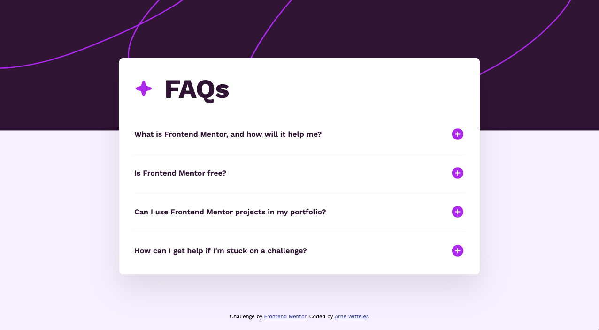

# Frontend Mentor - FAQ accordion solution

This is a solution to the [FAQ accordion challenge on Frontend Mentor](https://www.frontendmentor.io/challenges/faq-accordion-wyfFdeBwBz). Frontend Mentor challenges help you improve your coding skills by building realistic projects. 

## Table of contents

- [Frontend Mentor - FAQ accordion solution](#frontend-mentor---faq-accordion-solution)
  - [Table of contents](#table-of-contents)
  - [Overview](#overview)
    - [The challenge](#the-challenge)
    - [Screenshot](#screenshot)
    - [Links](#links)
  - [My process](#my-process)
    - [Built with](#built-with)
    - [What I learned](#what-i-learned)

## Overview

### The challenge

Users should be able to:

- Hide/Show the answer to a question when the question is clicked
- Navigate the questions and hide/show answers using keyboard navigation alone
- View the optimal layout for the interface depending on their device's screen size
- See hover and focus states for all interactive elements on the page

### Screenshot

### Links

- Solution URL: [Frontend Mentor solution](https://github.com/arne-witteler/faq-accordion)
- Live Site URL: [Live demo](https://faq-accordion-snowy-five.vercel.app)

## My process

### Built with

- Semantic HTML5 markup
- CSS custom properties
- Flexbox
- Mobile-first workflow
- JavaScript

### What I learned

This challenge helped me deepen my understanding of building accessible and responsive UI components.

I learned how to:
- Structure HTML using the BEM methodology for better readability and scalability.
- Replace non-semantic elements with `<button>` to make the accordion keyboard-accessible.
- Use `aria-expanded` to communicate open and closed states to assistive technologies.
- Implement smooth transitions with `max-height` and opacity to improve the user experience.
- Center elements both vertically and horizontally using Flexbox.
- Combine media queries and flexible units to achieve a mobile-first, responsive layout.

